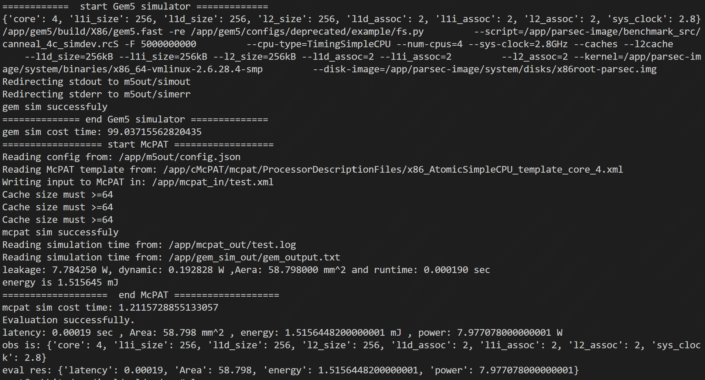

# dse_env
using gym api wapper the dse env

### Quick Start
Firstly, you need to clone this repo and install related dependencies.
```bash
git clone https://github.com/xue-yun-liang/dse_env.git  # clone this repo
cd dse_env                                              # into workspace path
bash pre.sh                                             # build three dirs for store
pip install -e .                                        # install envs
```
Then, you can run the test file by `cd gym_wapper/envs && python3 test.py`.After, you will see the output as the follow image.

### Description

This environment corresponds to the concept of multi-core processor design space
in the exploration of multi-core processor design space. A multi-core processor
has multiple different components, including the `core`, `l1i_size`, `l1d_size`,
`l2_size`, `l1d_assoc`, `l1i_assoc`, `l2_assoc`, `sys_clock`.At the beginning,
each variable is given a parameter, and each parameter can change the performance
of the entire processor through sampling (this step is called an action).

### Action Space

The action is different for each variable (or dimension). For example, it can be
changing the core or changing the sys_clock. Due to env having 8 variables,
the action is a numpy array of (8,), every element is int data type.

### Observation Space

The observation is a `ndarray` with shape `(8,)` with the values corresponding
to the following 8 variables:

The value rrange can be adjusted by adjust the dimension_discrete's 'rrange'

| Num | Observation  | default_value   |  step    |   Min    | Max      |
|-----|--------------|-----------------|----------|----------|----------|
| 0   | core         | 1               | 1        | 1        |  16      |
| 1   | l1i_size     | 2               | i**2     | 2        |  4096    |
| 2   | l1d_size     | 2               | i**2     | 2        |  4096    |
| 3   | l2_size      | 64              | i**2     | 64       |  65536   |
| 4   | l1d_assoc    | 1               | i**2     | 2        |  16      |
| 5   | l1i_assoc    | 1               | i**2     | 1        |  16      |
| 6   | l2_assoc     | 1               | i**2     | 1        |  16      |
| 7   | sys_clock    | 2               | 0.1      | 2.0      |  4.0     |

### Rewards
#### the reward 's compute logics:
Reward could be compute by constraints.get_punishment()
the equations is : $R_{s_t} = \prod_{i=1}^{n} O_i(s_t) \prod_{j=1}^{m} (C_j)/(P_j(s_t))^{l_j}$
where the $O_{i}(s_t)$ is the performance indicator. e.g. the optimization goal "energy" or "latency"
where the $P_{j}(s_t)$ is the constraint indicator. 
where the $C_{j}$ is the constraint indicators.

**Notes there is a hyperparams threshold_ratio, it as the $l_{j}$ contorl the total reward

### Starting State

The start state can adjust by dimension_discrete's 'default_value'

### Episode End

The episode ends if any one of the following occurs: when the epoches greater 50

### Arguments

Nothing

### Change the config

In the ./dse_env/gym_wapper/envs/ path, the `config.yaml` file store the design space's
parameter, change this file can fix the design space. And, in the same path, the `sim_config.yaml`
store the simulation files' path(If you use given docker container, it should not use to be changed.)


